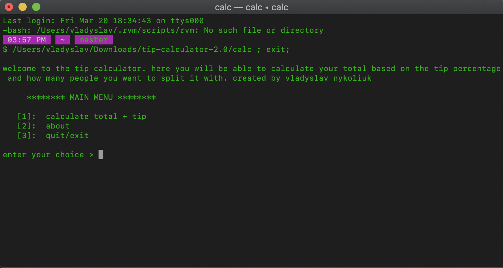

## About

Welcome to the tip-calculator :octocat:, a cross-platform mini-software where you can calculate your bill total, and split it.

## Build Status
working on it...

## Demo
*(cmd + click to open in a new page)*
[](https://youtu.be/53_-4U-qtWY)

## Tech/Framework Used
<b>Built with</b>
- [Python](https://www.python.org/)

## Features
Surely, more features to come but as of now, the project runs fluidly across the ```macOS```platform. Feel free to open pull requests to pitch in some code for new features.

## Installation
In order to get this mini-software on your operating system, head over to the [releases](https://github.com/vladyslavnUA/tip-calculator/releases) github page and download ```calc.zip```
When prompted whether to accept the file downloaded from the internet, click ```Accept```.
Once downloaded, ```unzip``` the file, ```double-click``` and the software will run.

## How to Use
To use my program, simply open it(```double-click```) and it will run. Then follow the prompt to enter values.

## Contribute
If you would like to contribute to the program, create a new [pull-request](https://github.com/vladyslavnUA/tip-calculator/pulls) and I will look at it.

## Credits
All copyright belongs solely to [vladyslav nykoliuk](https://github.com/vladyslavnUA?tab=repositories)

## License
MIT © [vladyslavnUA](https://github.com/vladyslavnUA)
